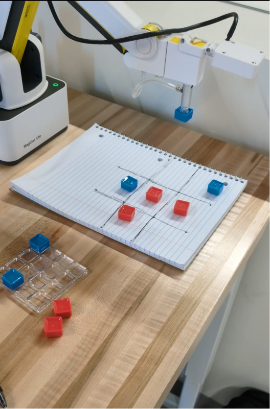
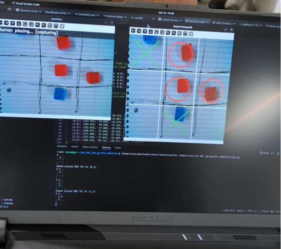

# Tic-Tac-Toe Playing Robot

[](https://docs.ros.org/en/humble/)
[](https://www.python.org/)

Interactive game-playing robot that plays Tic-Tac-Toe against human opponents using computer vision and Minimax AI algorithm for perfect strategic gameplay.

## 🎥 Demo

[**Watch Video Demo**](https://youtube.com/shorts/eE9nDp7xyAE) | [**website**](https://nivaspiduru.github.io/portfolio/portfolio-3-tictactoe-robot/)

### System in Action

<p align="center">
  
  
</p>

*Figure: (Left) Dobot Magician playing against human opponent. (Right) Real-time game state detection with color segmentation.*

## 🏗️ System Architecture
```
Vision System → HSV color detection + perspective warping
       ↓
Minimax AI → Recursive tree search for optimal moves
       ↓
Robot Control → Pick-and-place with suction gripper
```

## 🛠️ Technologies

**Framework**: ROS2 (Humble)  
**Language**: Python 3.10  
**Computer Vision**: OpenCV (HSV segmentation, perspective warping)  
**Algorithm**: Minimax with game tree evaluation  
**Hardware**: Dobot Magician Lite, USB camera, colored blocks (red/blue)

## 🎯 How It Works

1. **Setup**: Human chooses color (red/blue) and who goes first
2. **Vision**: Camera detects current game state via color segmentation
3. **AI Thinking**: Minimax algorithm calculates optimal next move
4. **Execution**: Robot picks block from pallet and places on board
5. **Repeat**: Turn-by-turn until win/draw

## 📦 Installation & Usage

### Prerequisites
```bash
pip install opencv-python
```

### Run
```bash
python3 tic-tac-toe.py
```

Follow on-screen prompts to:
- Choose your color (red/blue)
- Choose who goes first (human/robot)
- Play the game!

## 🎮 Gameplay Features

- Player customization (color choice, turn order)
- Real-time move validation
- Turn-by-turn logging
- Game outcome announcement (win/draw)


## 🎓 Context

**Course**: RAS 545 - Robotics and Autonomous Systems (Midterm 1)  
**Institution**: Arizona State University  
**Date**: October 2025

## 👨‍💻 Author

**Nivas Piduru**  
MS Robotics, Arizona State University  
📧 nivaspiduru@gmail.com | 🔗 [Portfolio](https://nivaspiduru.github.io)
